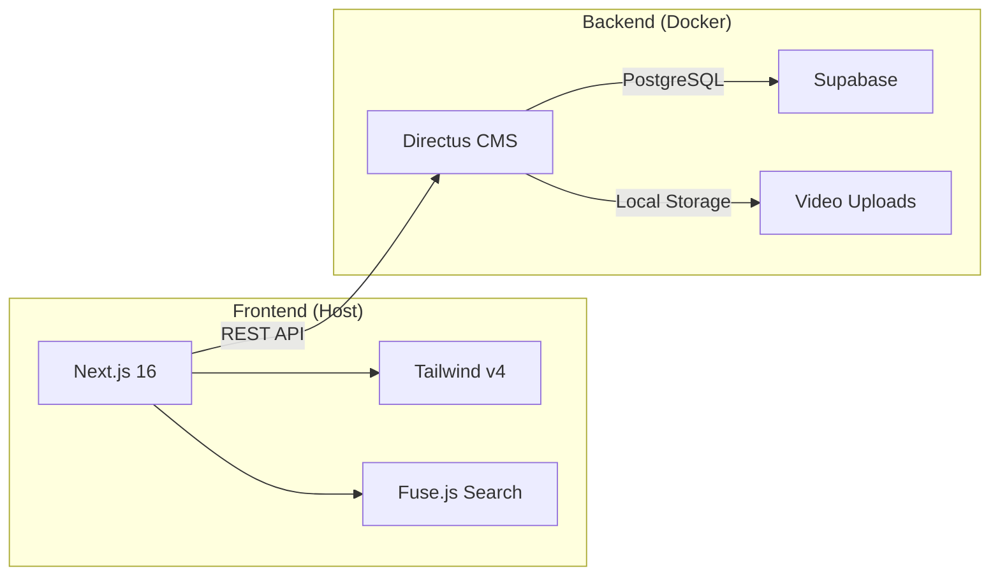

# 🤟 Kamus BISINDO (Bahasa Isyarat Indonesia)

Paltform kamus bahasa isyarat interaktif berbasis web yang dibangun dengan arsitektur **Modern Headless Stack**. Proyek ini dirancang untuk memberikan pengalaman pencarian yang cepat, responsif, dan mudah dikelola melalui sistem Content Management System (CMS).

---

## 🏗️ Arsitektur Sistem

Proyek ini menggunakan pemisahan yang jelas antara data, logika pengelolaan, dan tampilan (Frontend).



---

## 🛠️ Stack Teknologi & Peran

Berikut adalah rincian peran masing-masing teknologi yang digunakan dalam proyek ini:

### 1. **Next.js 16 (App Router)**
*   **Peran**: Kerangka kerja utama Frontend.
*   **Fungsi**: 
    *   **Server-Side Rendering (SSR)** & **Static Generation (ISR)** untuk performa SEO terbaik.
    *   Pencarian *Fuzzy* melalui Fuse.js agar pencarian tetap akurat meskipun ada salah ketik (typo).
    *   Navigasi antar halaman yang super cepat.

### 2. **Directus v11 (Headless CMS)**
*   **Peran**: Pusat Kontrol Konten (Admin Panel).
*   **Fungsi**:
    *   **Content Modeling**: Tempat kita mendefinisikan struktur data `Words`, `Categories`, dan `Provinces`.
    *   **Media Library**: Mengelola unggahan video kosa isyarat dengan aman dan terorganisir.
    *   **Access Control**: Mengatur siapa yang bisa melihat atau mengubah data (Public vs Admin).
    *   **API Engine**: Secara otomatis mengubah database menjadi REST API yang siap dikonsumsi Frontend.

### 3. **Supabase (PostgreSQL)**
*   **Peran**: Gudang Data Utama.
*   **Fungsi**: 
    *   Menyimpan semua data teks dan relasi antar tabel secara permanen dan terenskripsi.
    *   Menyediakan infrastruktur database kelas industri tanpa perlu ribet mengelola server database sendiri.

### 4. **Tailwind CSS v4**
*   **Peran**: Sistem Desain.
*   **Fungsi**: Memberikan tampilan yang premium, modern, dan responsif dengan performa CSS yang sangat dioptimalkan.

---

## 📁 Struktur Proyek

```bash
├── .ai/                   # Konteks proyek & dokumentasi agen AI
├── backend/               # Konfigurasi Backend (Docker & Scripts)
│   ├── uploads/           # Penyimpanan video kosa isyarat (Ignored in Git)
│   ├── docker-compose.yml # Konfigurasi container Directus
│   ├── setup-schema.js    # Skrip inisialisasi tabel/field otomatis
│   ├── setup-permissions.js # Skrip konfigurasi hak akses Public
│   └── clear-data.js      # Skrip pembersih database
├── src/                   # Source code Frontend (Next.js)
│   ├── app/               # Routing & Halaman (Beranda, Detail)
│   ├── components/        # UI Reusable (Navbar, Card, Filter)
│   ├── lib/               # Utilitas (Directus client, Search logic)
│   └── types.ts           # Definisi tipe data TypeScript
└── README.md              # Dokumentasi ini
```

---

## 🚀 Panduan Pengembangan

### Jalankan Backend (Directus)
Pastikan Docker Desktop sudah menyala di perangkat Anda.
```bash
cd backend
docker-compose up -d
```
Akses Admin di: `http://localhost:8055` (User: `admin@bisindo.id` / Pass: `password123`)

### Jalankan Frontend (Next.js)
```bash
npm install
npm run dev
```
Akses Website di: `http://localhost:3000`

---

## ⚡ Skrip Utilitas Backend

Kami menyediakan beberapa skrip untuk mempercepat pengelolaan database Directus:

| Nama Skrip | Fungsi Utama |
|------------|--------------|
| `node backend/setup-schema.js` | Membuat otomatis koleksi `words`, `categories`, dan `provinces`. |
| `node backend/setup-permissions.js` | Membuka izin akses agar publik bisa melihat kosa kata tanpa login. |
| `node backend/clear-data.js` | Menghapus semua isi database untuk reset (hati-hati!). |

---

## 💎 Filosofi Desain
Website ini mengedepankan **Accessibility** dan **Visual Excellence**. Penggunaan gradien halus, animasi mikro pada hover, serta penempatan filter yang strategis dirancang agar komunitas Tuli dapat mengakses informasi dengan nyaman dan menyenangkan.

---

> [!IMPORTANT]
> Proyek ini sedang dalam tahap **Fase 4 (Polish & Enhancement)**. Fokus saat ini adalah optimasi UX dan persiapan *deployment* ke server produksi.
